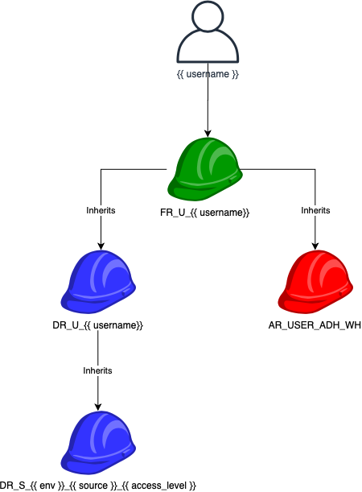
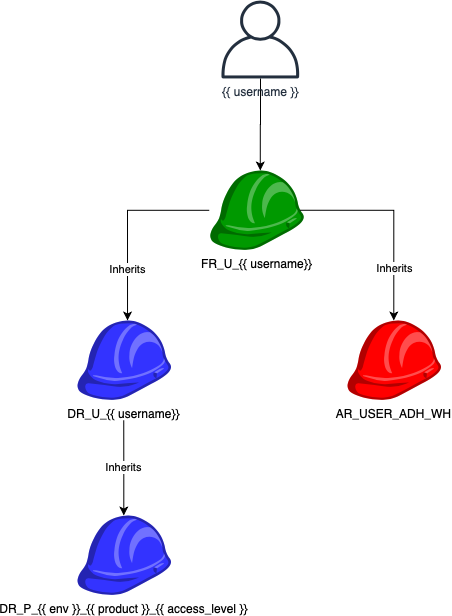
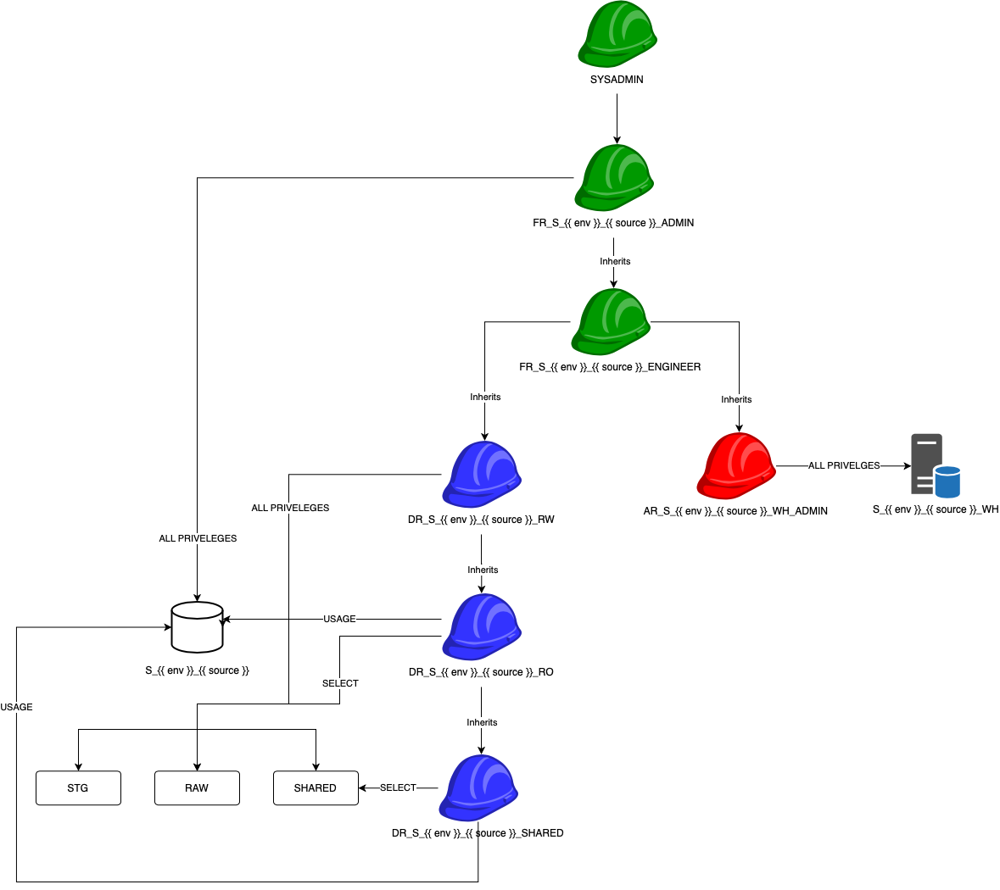
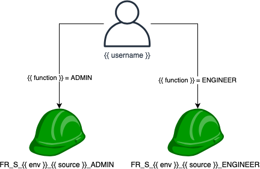
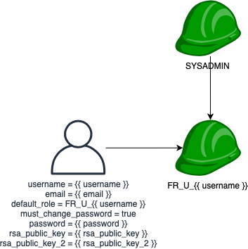
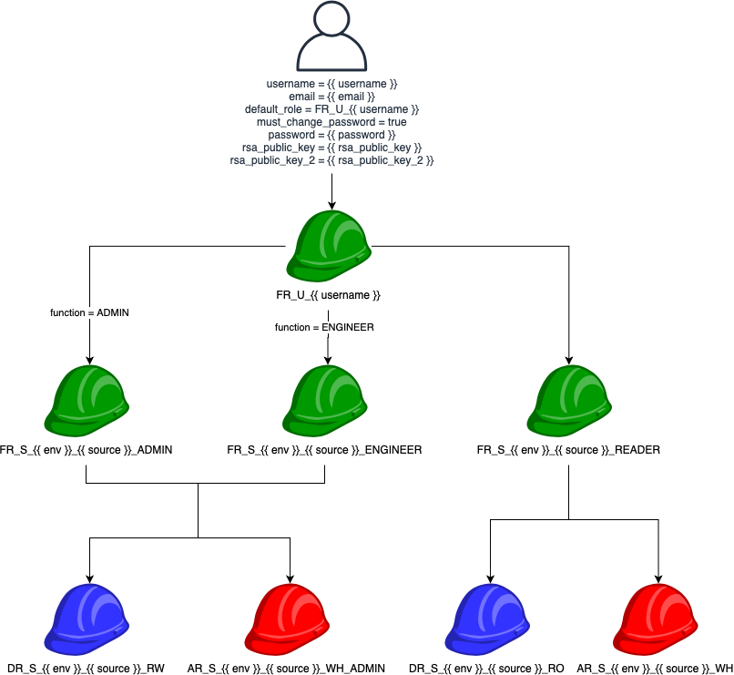

# Base Tram Stack

This repository is base example stack for deploying a new Snowflake environment.  This example covers creating data sources, users, service accounts, and role memberships.  Use this repository as a template or starting point when integrating Tram for a customer.

# Roles
In order to create a simple role hierarchy, this repository uses functional roles to clearly state purpose.

## Functional Roles (FR)
A functional role inherits permissions from data roles(DR) or access roles(AR).  Functional roles should be used for all query contexts which require the use of both a warehouse and database to execute.  Almost all queries will be run using a functional role.

## Data Roles (DR)
A Data role defines the {{ access_level }} to a specific database or schema.  Data roles can be used for granting access to other databases.

## Access Roles (AR)
Access roles grant access to other Snowflake objects to a functional role.  The most common access role is granting warehouse access to a functional roles.  Access roles are also used to grant access to stroage integrations or task operator.

# Models
At the core of this stack are 3 distinct groupings of databases, schemas, warehouses, roles, and permissions.

## User
[User](base-stack/models/user.yml) models create new user, create a new schema `{{ username }}` in the `USER` database, and grant access to the `USER_ADH_WH` warehouse (ADH stands for adhoc).

A user workspace can be granted access to sources or products using the [groups/user-sources.yml](base-stack/groups/users-sources.yml) or [groups/user-products.yml](base-stack/groups/user-products.yml).  Adding entries in these files allow a user to develop in their workspace against a source or product dataset.

### User Source
`{{ access_level }}`:

- **RW**: Grants the user workspace read write access to the data source.  NOTE: Rarely should users be granted RW access at this level instead they should be granted functional access to the data source using [groups/source-members.yml](base-stack/groups/source-members.yml).
- **RO**: Grants the user workspace read only access to all schemas in the source database.
- **SHARED**: Grants the user workspace read only access to the `SHARED` schema in the source databases.

### User Product
`{{ access_level }}`:

- **RW**: Grants the user workspace read write access to the data source.  NOTE: Rarely should users be granted RW access at this level instead they should be granted functional access to the data source using [groups/source-members.yml](base-stack/groups/source-members.yml).
- **RO**: Grants the user workspace read only access to all schemas in the source database.
- **SHARED**: Grants the user workspace read only access to the `SHARED` schema in the source databases.

## Source
The Data source model is used to define an external data source.  These sources could be RDMS, Data Lake files, Kafka Topics, SFTP files, or any other data set that is going to be ingested into Snowflake and used as a part of a product.

### Source Member
Users can be granted functional access to a data source using the [groups/source-members.yml](base-stack/groups/source-members.yml) file.  These memberships define users who are most likely part of the data engineering team ingesting the source systems into Snowflake.

`{{ function }}`:

- **ADMIN**: Grants a user ALL privileges on the source database and the schemas.  This user will also have ALL privileges on the source warehouse.
- **ENGINEER**: Grants a user USAGE privileges on the source database and ALL privileges on the schemas.  This user will also have ALL privileges on the source warehouse.

## Product
A data [product](base-stack/models/product.yml) (or project) consume data from a data source curate that data and present it the new insights for consumption.  A Product can be granted access to one or more sources and contain the business logic for a product or application.

### Product Source
Products can be granted access to data sources using the [groups/product-sources.yml](base-stack/groups/product-sources.yml) file.

`{{ access_level }}`:

- **RW**: Grants the product read write access to the data source.  NOTE: Rarely should users be granted RW access at this level instead they should be granted functional access to the data source using [groups/source-members.yml](base-stack/groups/source-members.yml).
- **RO**: Grants the product read only access to all schemas in the source database.
- **SHARED**: Grants the product read only access to the `SHARED` schema in the source databases.

### Product Member
Product members are users who have access to the product data sets.  These members may be engineers, report developers, data scientist, or any other consumer.

`{{ function }}`:

- **ADMIN**:  Grants a user to the functional role that has full admin access to the product.  This user will have ALL privileges to the database, schemas, and warehouse.
- **ENGINEER**: Grants a user to the functional role that has USAGE privileges on the database and ALL privileges on schemas and warehouse.
- **READER**: Grants a user to the functional role that USAGE access to the database and warehouse, and SELECT privileges to the schemas.

## Service Account
A [service account](base-stack/models/service-account.yml) is a way to configure programmatic to a data source or product.  Unlike a regular user a service account does not get a workspace with a database and schema.  Service accounts should only ever be granted access to a source or product functional role.

### Service Account Source
Service accounts can be granted functional access to a source using the [groups/service-account-sources.yml](base-stack/groups/service-account-sources.yml) file.

`{{ function }}`:

- **ADMIN**: Grants a service account ALL privileges on the source database and the schemas.  This service account will also have ALL privileges on the source warehouse.
- **ENGINEER**: Grants a service account USAGE privileges on the source database and ALL privileges on the schemas.  This service account will also have ALL privileges on the source warehouse.

### Service Account Product
Service accounts can be granted functional access to a product using the [groups/service-account-product.yml](base-stack/groups/service-account-product.yml) file.

`{{ function }}`:

- **ADMIN**:  Grants a service account to the functional role that has full admin access to the product.  This service account will have ALL privileges to the database, schemas, and warehouse.
- **ENGINEER**: Grants a service account to the functional role that has USAGE privileges on the database and ALL privileges on schemas and warehouse.
- **READER**: Grants a service account to the functional role that USAGE access to the database and warehouse, and SELECT privileges to the schemas.

## Snowflake Admin Roles
To a user access to Snowflake's built in administrator roles use the [groups/admin-members.yml](base-stack/groups/admin-members.yml) file.

See Snowflake documentation on built in user roles.

